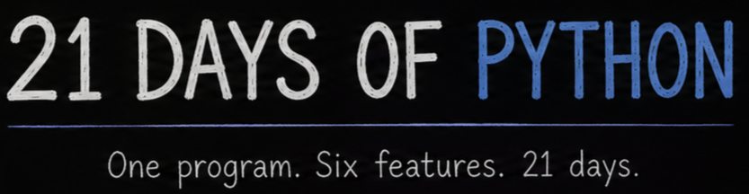

# 21-Days-of-Python

A little Python project I’m making for the Stardance Sticky Streaks challenge! I’ll spend the first 3 days on the foundation, then add a new feature every 3 days. By the end, it’ll have 6 fun features all in one place.

## How to install!

1. Go to the [GitHub Releases](../../releases) page.
2. Open the latest release.
3. Download `21-Days-of-Python-windows.zip`.
4. Extract the ZIP file.
5. Open the extracted folder.
6. Run `main.exe`.
7. You have successfully completed this setup guide and can now use the program. Good job! :)
